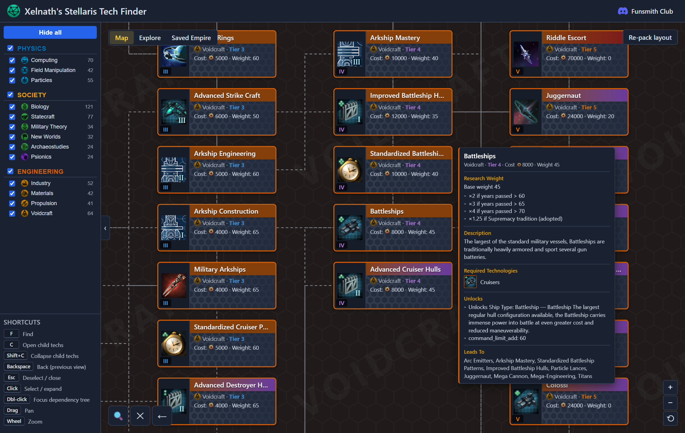
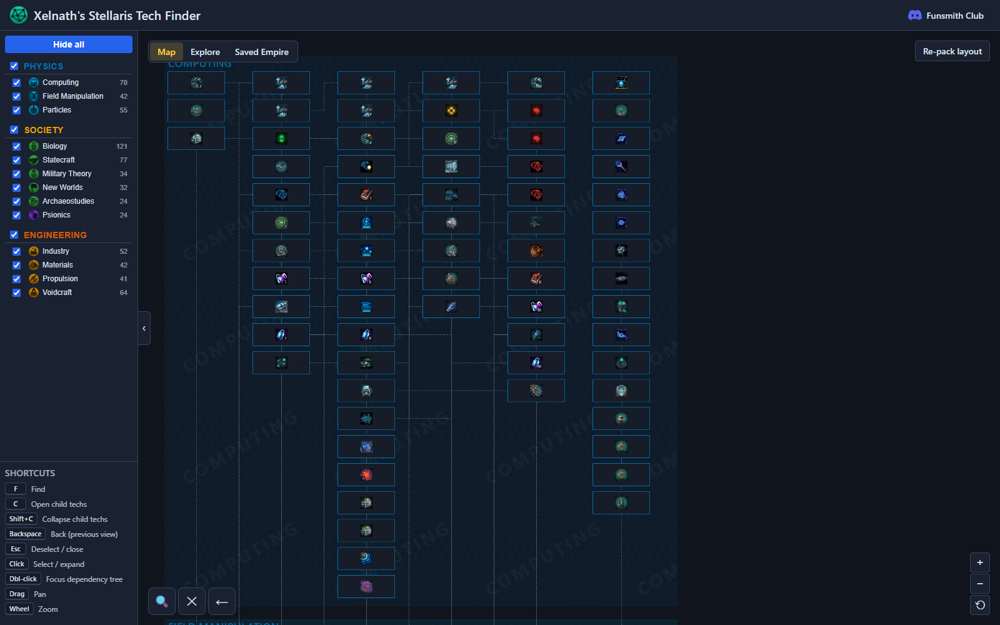
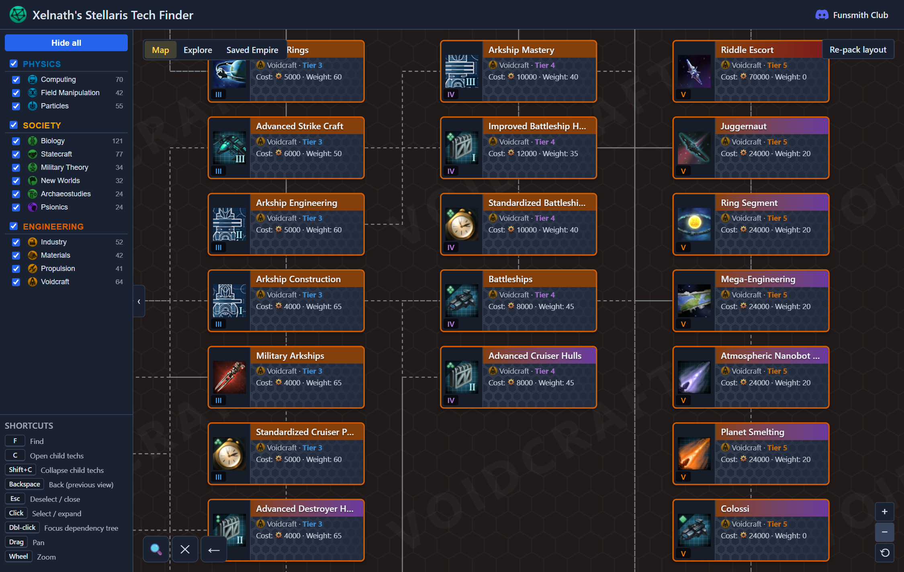
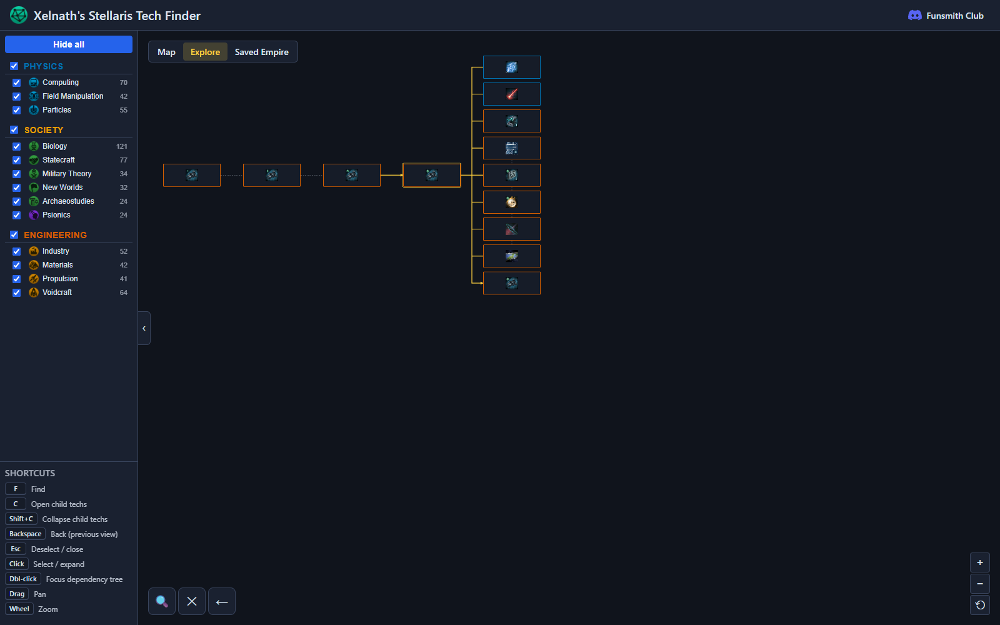
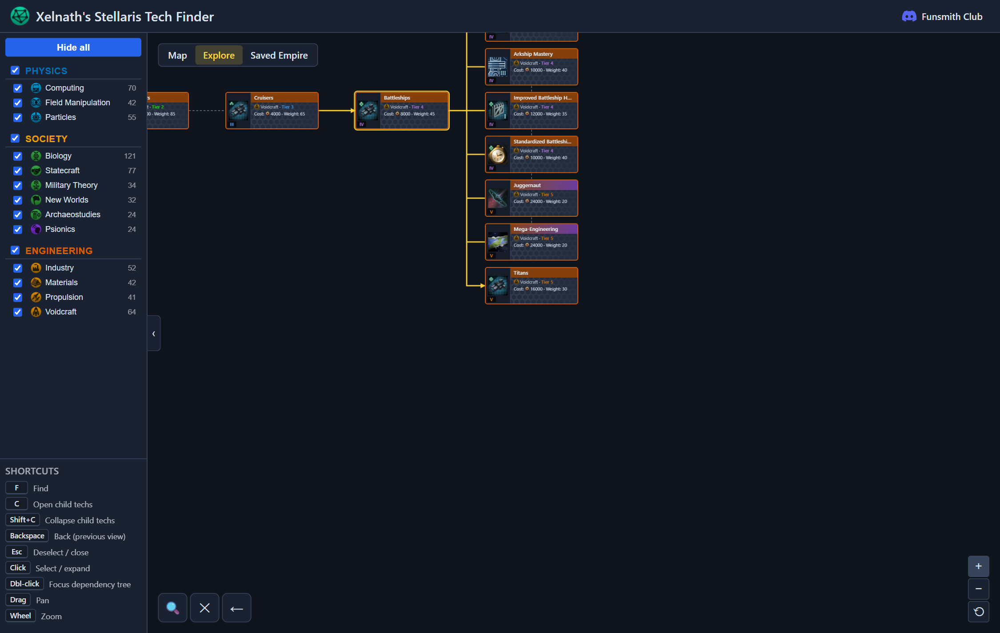
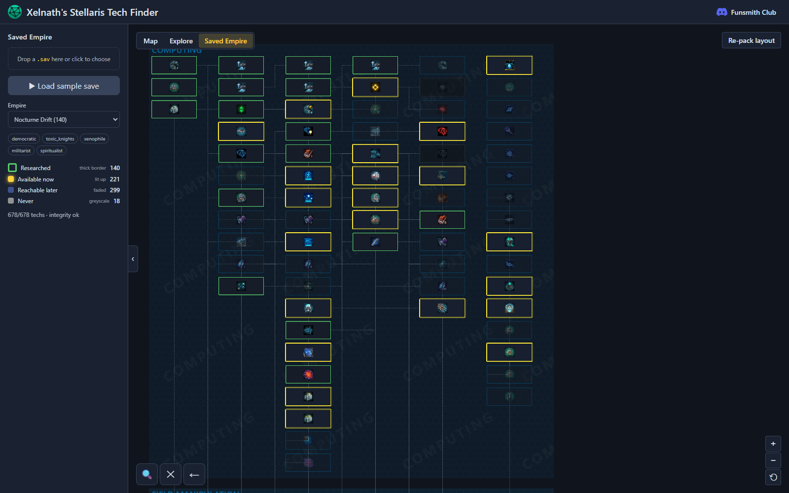
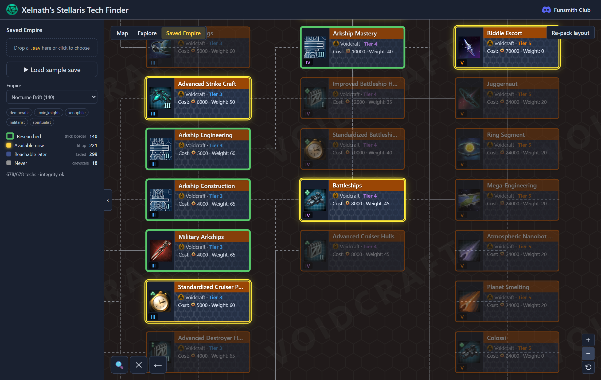

# How the Tech Finder Works

**Xelnath's Stellaris Tech Finder** is an interactive, browser-based tech tree for
Stellaris **v4.5.0 "Cygnus"**. It renders all **678 technologies** parsed straight
from the game files, laid out as DOM cards with an imperative pan/zoom canvas so it
stays smooth at full scale.

The tree has three modes, switched from the toggle at the top-left of the canvas:
**Map**, **Explore**, and **Saved Empire**.

---

## Layout basics

- **Areas & categories** — every tech belongs to one of three research **areas**
  (Physics, Society, Engineering), each split into **categories** (Computing,
  Biology, Voidcraft, …). The left sidebar lists them with live tech counts.
- **Tiers flow left → right** — a tech's prerequisites sit to its left, the techs it
  unlocks to its right. Edges connect a tech to its prerequisites.
- **Filtering** — tick/untick a category (or a whole area) in the sidebar to show or
  hide it. **Hide all** clears everything; click a category name to *isolate* it and
  frame it in the viewport.

## Navigation (shared by every mode)

| Action | Result |
|--------|--------|
| **Drag** | Pan the canvas |
| **Wheel** | Zoom toward the cursor (zoom out far enough and cards drop to icon-only tiles) |
| **Hover** | Show a tooltip with the tech's cost, prerequisites, and what it unlocks |
| **Click** | Select / highlight a tech (and expand it in Explore) |
| **Double-click** | Jump into **Explore** focused on that tech's dependency tree |
| **F** | Open fuzzy **Find** — search any tech by name and jump to it |
| **C / Shift+C** | Open / collapse the selected tech's child techs |
| **Backspace** | Back to the previous view · **Esc** deselect |

The current view (mode, selection, filters, expansion) is mirrored into the URL, so a
copied link reproduces exactly what's on screen.

**Hovering any card** pops a detail tooltip — cost, research-weight modifiers,
description, required technologies, what it unlocks, and what it leads to:

---

## 1. Map

The default view: a **banded swimlane layout**. Each category is a horizontal band
(watermarked with its name), and every tech is placed once by an ELK hierarchical
layout so the full tree is visible at a glance. Use **Re-pack layout** after filtering
to close the gaps left by hidden categories and re-stack the visible bands tightly.

Zoomed in, each card shows its name, tier, category, cost, and research weight
(here the *Battleships* neighborhood in the Voidcraft band, with the selected card and
its edges highlighted in gold):

Best for: getting the big picture and seeing how whole areas relate.

## 2. Explore

A **collapsible dependency tree**. Open it and it starts at the entry-point techs;
click a card's chevron to expand its children one tier at a time. Double-clicking a
tech (from any mode) drops you into its **focus view**, shown above for
*Battleships*: the tech's entire recursive **prerequisite chain fans out to the left**
and the techs that **directly depend on it fan out to the right**, with the focused
tech and its path highlighted in gold. The view auto-zooms to frame the neighborhood.

Zoomed in, the chain reads clearly — *…Tier 2 → Cruisers → **Battleships** →* its
dependents (Arkship Mastery, Improved Battleship Hulls, Juggernaut, Mega-Engineering,
Titans, …):

Best for: answering "what do I need to reach tech X, and what does X lead to?"

## 3. Saved Empire

Drop in a Stellaris **`.sav` file** (or, in dev, click **Load sample save**) and the
tool parses it **entirely in the browser** — no upload. Pick an empire from the save
and every card is recolored by how that empire stands relative to it:

| Bucket | Look | Meaning |
|--------|------|---------|
| **Researched** | thick green border | already unlocked |
| **Available now** | lit up / yellow | prerequisites met — can research immediately |
| **Reachable later** | faded blue | reachable once earlier techs are done |
| **Never** | greyscale | gated out for this empire (wrong ethics/origin/authority, etc.) |

The legend shows a live count per bucket and an integrity check (e.g.
`678/678 techs · integrity ok`). The empire's identity chips (authority, origin,
ethics) appear above the legend.

Zoomed in, the buckets are easy to tell apart at a glance — green-bordered
*Researched* cards next to lit-up *Available now* and faded *Reachable later* ones:

Best for: seeing where a *specific* save game stands and planning what to research next.

---

## Under the hood

- **Data pipeline** — game files are parsed at build time with `jomini` (the
  Clausewitz-format parser) into a single `tech.json` snapshot; icons are decoded from
  DDS and emitted as WebP. Re-running the pipeline is how the tool tracks new patches.
- **Rendering** — DOM cards inside one transformed canvas; pan/zoom is applied
  imperatively (no React re-render), with level-of-detail tiles when zoomed out, so
  the full 678-node tree stays responsive.
- **Layout** — `elkjs` computes the banded Map layout once; Explore's tree is a cheap
  synchronous DFS recomputed on each expand/collapse.
- **Saved Empire** — the `.sav` is unzipped and parsed client-side, then each tech is
  classified against the empire's researched set and unlock gates.

*Screenshots in [`docs/screenshots/`](screenshots/) are regenerated from the running
dev server.*
